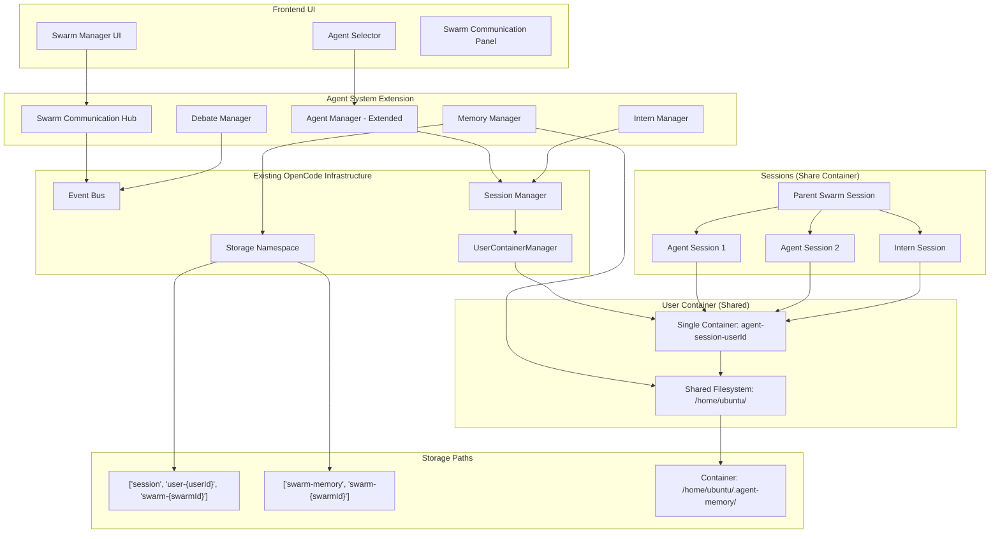

# Agent蜂群功能设计文档

## Overview

Agent蜂群功能是基于现有OpenCode架构的多智能体协作系统扩展。该系统复用现有的子智能体(subagent)机制，通过新增"swarm"模式的agent，实现多个AI agent的并行协作和跨蜂群通信。设计遵循OpenCode的"Model-First Architecture"和"Simplicity Principle"，最小化硬编码逻辑，最大化模型能力。

### 核心设计理念

1. **复用现有子智能体机制**: 基于现有的Session parent-child关系
2. **新增swarm模式**: 在现有的"primary"、"subagent"、"all"基础上新增"swarm"模式
3. **Storage持久化**: 使用Storage namespace存储蜂群状态和共享内存
4. **Bus事件通信**: 使用Bus系统实现蜂群间通信和SSE推送
5. **用户容器共享**: 所有Session（包括蜂群agents）共享同一个用户容器
6. **前端集成**: 复用现有的agent选择UI，新增蜂群管理界面

### 架构发现要点

基于实际代码库探索，以下是关键架构组件：

1. **Storage机制**: JSON文件存储在 `~/.opencode/storage/`，支持MongoDB+GridFS（可选）
2. **Bus系统**: 事件总线，支持发布订阅模式，通过SSE推送到前端
3. **Agent模式**: 当前支持 "primary", "subagent", "all"（需新增 "swarm"）
4. **Session架构**: 父子会话关系（parentID），每个会话可关联Docker容器
5. **用户容器**: 使用 `UserContainerManager`，每个用户一个容器（`opencode-sandbox-playwright:latest`），所有Session共享，工作目录 `/home/ubuntu`

## Architecture

### 核心架构原则

1. **扩展现有Agent系统**: 基于现有的Agent.Info，新增"swarm"模式
2. **Storage持久化**: 使用Storage namespace存储蜂群状态，路径: `["session", "user-{userId}", "swarm-{swarmId}"]`
3. **Bus事件驱动**: 使用Bus.publish/subscribe实现蜂群通信，通过SSE推送到前端
4. **Session层级管理**: 蜂群作为父Session，各agent作为子Session（复用parentID机制）
5. **用户容器共享**: 所有Session共享同一个用户容器（由UserContainerManager管理）
6. **前端集成**: 复用现有的agent选择器，新增蜂群管理UI

### 容器架构（关键修正）

**正确的容器架构**:
- **每个用户一个容器**（不是每个agent一个容器）
- `UserContainerManager.getOrCreateContainer({ userId })` 管理用户级容器
- 容器命名: `agent-session-{userId}`
- 所有Session（主agent、子agent、蜂群agents、intern）共享同一个用户容器
- 容器生命周期: 首次使用时创建，空闲5分钟后休眠，可被唤醒
- 共享资源: 所有agents共享CPU、内存、磁盘、网络
- 共享文件系统: 所有agents看到相同的 `/home/ubuntu/` 目录

**成本模型**:
- **Token成本**: 每个Session = 独立的Claude实例（高成本，多agents = 多倍token消耗）
- **容器成本**: 每个用户一个容器（低成本，共享）
- Intern优化: 快速销毁Session节省token，容器保持运行

**Agent隔离**:
- 隔离在Session层面（独立的上下文窗口、消息历史）
- 不在容器层面隔离
- Agents共享文件系统 `/home/ubuntu/`
- 信任agents不会删除彼此的文件

### 系统架构图



### Agent模式扩展

现有Agent模式（来自 `packages/opencode/src/agent/agent.ts`）：
- `primary`: 主要agent（如build、plan）
- `subagent`: 子agent（如general、explore）
- `all`: 通用agent

新增模式：
- `swarm`: 蜂群agent，支持多实例并行和跨蜂群通信

## Components and Interfaces

### 1. Agent系统扩展

**职责**: 扩展现有Agent.Info支持蜂群模式

**实际文件**: `packages/opencode/src/agent/agent.ts`

```typescript
// 扩展现有Agent.Info（在agent.ts中）
export namespace Agent {
  export const Info = z
    .object({
      // ... 现有字段
      mode: z.enum(["subagent", "primary", "all", "swarm"]), // 新增swarm模式
      swarmConfig: z.object({
        maxInstances: z.number().default(3),
        communicationScope: z.enum(["local", "global"]).default("local"),
        autoScale: z.boolean().default(false),
        debateEnabled: z.boolean().default(true), // 新增：辩论模式开关
        internEnabled: z.boolean().default(true), // 新增：Intern支持
      }).optional()
    })
}

// 蜂群Agent配置示例
const swarmAgent: Agent.Info = {
  name: "research-swarm",
  mode: "swarm",
  description: "Research swarm for parallel information gathering",
  swarmConfig: {
    maxInstances: 5,
    communicationScope: "global",
    autoScale: true,
    debateEnabled: true,
    internEnabled: true
  }
}
```

### 2. Session扩展支持蜂群

**职责**: 扩展Session.Info支持蜂群元数据

**实际文件**: `packages/opencode/src/session/index.ts`

```typescript
// 扩展Session.Info（在session/index.ts中）
export namespace Session {
  export const Info = z.object({
    // ... 现有字段
    swarmMetadata: z.object({
      swarmId: z.string(),
      role: z.enum(["coordinator", "worker", "intern"]),
      parentSwarmId: z.string().optional(),
      debateSessionId: z.string().optional(),
    }).optional()
  })
}

// 创建蜂群父Session
const swarmSession = await Session.createNext({
  title: "Research Swarm",
  userId: "user-123",
  swarmMetadata: {
    swarmId: "swarm-abc",
    role: "coordinator"
  }
})

// 创建worker实例（子Session）
const workerSession = await Session.createNext({
  parentID: swarmSession.id,
  title: "Worker Instance 1",
  userId: "user-123",
  swarmMetadata: {
    swarmId: "swarm-abc",
    role: "worker",
    parentSwarmId: swarmSession.id
  }
})
```

### 3. Storage路径结构

**职责**: 定义蜂群数据的存储路径

**实际文件**: `packages/opencode/src/storage/storage.ts`

```typescript
// 蜂群存储路径定义
export namespace SwarmStorage {
  // 蜂群元数据
  export function getSwarmPath(userId: string, swarmId: string): string[] {
    return ["session", `user-${userId}`, `swarm-${swarmId}`]
  }
  
  // 蜂群共享内存
  export function getSwarmMemoryPath(swarmId: string): string[] {
    return ["swarm-memory", swarmId]
  }
  
  // 辩论会话
  export function getDebatePath(swarmId: string, debateId: string): string[] {
    return ["swarm-debate", swarmId, debateId]
  }
  
  // Intern任务
  export function getInternTaskPath(swarmId: string, internId: string): string[] {
    return ["swarm-intern", swarmId, internId]
  }
}

// 使用示例
await Storage.write(
  SwarmStorage.getSwarmPath("user-123", "swarm-abc"),
  { status: "active", instances: 3 }
)
```

### 4. Bus事件定义

**职责**: 定义蜂群相关的Bus事件

**实际文件**: `packages/opencode/src/bus/index.ts`

```typescript
// 在Bus namespace中新增蜂群事件（bus/index.ts）
export namespace Bus {
  // 蜂群生命周期事件
  export const SwarmCreated = BusEvent.define(
    "swarm.created",
    z.object({
      swarmId: z.string(),
      userId: z.string(),
      agentType: z.string(),
      instanceCount: z.number(),
    })
  )
  
  export const SwarmScaled = BusEvent.define(
    "swarm.scaled",
    z.object({
      swarmId: z.string(),
      oldCount: z.number(),
      newCount: z.number(),
    })
  )
  
  // 蜂群通信事件
  export const SwarmMessage = BusEvent.define(
    "swarm.message",
    z.object({
      swarmId: z.string(),
      fromInstanceId: z.string(),
      toInstanceId: z.string().optional(), // 可选，用于点对点
      messageType: z.enum(["task_result", "information_share", "coordination", "request"]),
      content: z.any(),
      timestamp: z.number(),
    })
  )
  
  // 辩论模式事件
  export const DebateStarted = BusEvent.define(
    "swarm.debate.started",
    z.object({
      swarmId: z.string(),
      debateId: z.string(),
      conflictingAgents: z.array(z.string()),
      topic: z.string(),
    })
  )
  
  export const DebateArgument = BusEvent.define(
    "swarm.debate.argument",
    z.object({
      debateId: z.string(),
      agentId: z.string(),
      argument: z.string(),
      evidence: z.array(z.string()),
    })
  )
  
  export const DebateResolved = BusEvent.define(
    "swarm.debate.resolved",
    z.object({
      debateId: z.string(),
      winningAgentId: z.string(),
      decision: z.string(),
      reasoning: z.string(),
    })
  )
  
  // Intern事件
  export const InternCreated = BusEvent.define(
    "swarm.intern.created",
    z.object({
      swarmId: z.string(),
      internId: z.string(),
      task: z.string(),
    })
  )
  
  export const InternCompleted = BusEvent.define(
    "swarm.intern.completed",
    z.object({
      internId: z.string(),
      result: z.any(),
      duration: z.number(),
    })
  )
}

// 发布事件示例
await Bus.publish(Bus.SwarmCreated, {
  swarmId: "swarm-abc",
  userId: "user-123",
  agentType: "research-swarm",
  instanceCount: 3
})

// 订阅事件示例
Bus.subscribe(Bus.SwarmMessage, async (event) => {
  console.log("Swarm message:", event.properties)
})
```

### 5. 辩论管理器

**职责**: 管理agent间的辩论会话

```typescript
export namespace DebateManager {
  interface DebateSession {
    id: string
    swarmId: string
    topic: string
    conflictingAgents: string[]
    arguments: Map<string, { argument: string; evidence: string[] }>
    status: "active" | "resolved"
    resolution?: {
      winningAgentId: string
      decision: string
      reasoning: string
    }
  }
  
  export async function startDebate(input: {
    swarmId: string
    conflictingAgents: string[]
    topic: string
  }): Promise<DebateSession> {
    const debateId = Identifier.ascending("debate")
    const session: DebateSession = {
      id: debateId,
      swarmId: input.swarmId,
      topic: input.topic,
      conflictingAgents: input.conflictingAgents,
      arguments: new Map(),
      status: "active"
    }
    
    // 存储辩论会话
    await Storage.write(
      SwarmStorage.getDebatePath(input.swarmId, debateId),
      session
    )
    
    // 发布事件
    await Bus.publish(Bus.DebateStarted, {
      swarmId: input.swarmId,
      debateId,
      conflictingAgents: input.conflictingAgents,
      topic: input.topic
    })
    
    return session
  }
  
  export async function submitArgument(input: {
    debateId: string
    agentId: string
    argument: string
    evidence: string[]
  }): Promise<void> {
    const debate = await getDebate(input.debateId)
    debate.arguments.set(input.agentId, {
      argument: input.argument,
      evidence: input.evidence
    })
    
    await Storage.update(
      SwarmStorage.getDebatePath(debate.swarmId, debate.id),
      (draft) => Object.assign(draft, debate)
    )
    
    await Bus.publish(Bus.DebateArgument, input)
  }
  
  export async function resolveDebate(input: {
    debateId: string
    winningAgentId: string
    decision: string
    reasoning: string
  }): Promise<void> {
    const debate = await getDebate(input.debateId)
    debate.status = "resolved"
    debate.resolution = {
      winningAgentId: input.winningAgentId,
      decision: input.decision,
      reasoning: input.reasoning
    }
    
    await Storage.update(
      SwarmStorage.getDebatePath(debate.swarmId, debate.id),
      (draft) => Object.assign(draft, debate)
    )
    
    await Bus.publish(Bus.DebateResolved, input)
  }
  
  async function getDebate(debateId: string): Promise<DebateSession> {
    // 实现从Storage读取辩论会话
    throw new Error("Not implemented")
  }
}
```

### 6. Intern管理器

**职责**: 管理临时一次性agent实例

```typescript
export namespace InternManager {
  interface InternTask {
    id: string
    swarmId: string
    task: string
    sessionId: string
    status: "pending" | "running" | "completed" | "failed"
    result?: any
    createdAt: number
    completedAt?: number
  }
  
  export async function createIntern(input: {
    swarmId: string
    task: string
    userId: string
  }): Promise<InternTask> {
    const internId = Identifier.ascending("intern")
    
    // 创建临时Session（标记为ephemeral）
    const session = await Session.createNext({
      parentID: input.swarmId, // 父Session是蜂群
      title: `Intern: ${input.task}`,
      userId: input.userId,
      swarmMetadata: {
        swarmId: input.swarmId,
        role: "intern"
      }
    })
    
    const intern: InternTask = {
      id: internId,
      swarmId: input.swarmId,
      task: input.task,
      sessionId: session.id,
      status: "pending",
      createdAt: Date.now()
    }
    
    await Storage.write(
      SwarmStorage.getInternTaskPath(input.swarmId, internId),
      intern
    )
    
    await Bus.publish(Bus.InternCreated, {
      swarmId: input.swarmId,
      internId,
      task: input.task
    })
    
    return intern
  }
  
  export async function completeIntern(input: {
    internId: string
    result: any
  }): Promise<void> {
    // 读取intern任务
    const intern = await getIntern(input.internId)
    intern.status = "completed"
    intern.result = input.result
    intern.completedAt = Date.now()
    
    // 更新存储
    await Storage.update(
      SwarmStorage.getInternTaskPath(intern.swarmId, intern.id),
      (draft) => Object.assign(draft, intern)
    )
    
    // 发布完成事件
    await Bus.publish(Bus.InternCompleted, {
      internId: input.internId,
      result: input.result,
      duration: intern.completedAt! - intern.createdAt
    })
    
    // 销毁Session和容器
    await Session.remove(intern.sessionId)
  }
  
  async function getIntern(internId: string): Promise<InternTask> {
    // 实现从Storage读取intern任务
    throw new Error("Not implemented")
  }
}
```

### 7. 内存管理器

**职责**: 管理蜂群共享内存和agent私有内存（简化版）

```typescript
export namespace MemoryManager {
  // 蜂群共享内存（使用Storage）
  export async function writeSwarmMemory(
    swarmId: string,
    key: string,
    value: any
  ): Promise<void> {
    const memoryPath = SwarmStorage.getSwarmMemoryPath(swarmId)
    const memory = await Storage.read<Record<string, any>>(memoryPath).catch(() => ({}))
    memory[key] = value
    await Storage.write(memoryPath, memory)
  }
  
  export async function readSwarmMemory(
    swarmId: string,
    key: string
  ): Promise<any> {
    const memoryPath = SwarmStorage.getSwarmMemoryPath(swarmId)
    const memory = await Storage.read<Record<string, any>>(memoryPath).catch(() => ({}))
    return memory[key]
  }
  
  // Agent私有内存（简化 - 让agents自己管理文件）
  // 所有agents共享用户容器的 /home/ubuntu/ 文件系统
  // Agents可以在 /home/ubuntu/.agent-memory/{agentId}/ 创建自己的文件
  // 不需要显式的初始化/清理 - 信任agents管理自己的文件
  
  export function getAgentMemoryPath(agentId: string): string {
    return `/home/ubuntu/.agent-memory/${agentId}/`
  }
}
```

## Data Models

### 核心数据模型

```typescript
// 扩展现有Session模型
interface SwarmSession extends Session {
  mode: "swarm"
  swarmConfig: {
    agentType: string
    instanceCount: number
    communicationEnabled: boolean
    autoScale: boolean
  }
  instances: string[] // 子会话ID列表
}

// 蜂群消息模型
interface SwarmMessage {
  id: string
  type: 'task_result' | 'information_share' | 'coordination' | 'request' | 'broadcast'
  fromInstanceId: string
  toInstanceId?: string // 可选，用于点对点通信
  swarmId: string
  content: {
    text?: string
    data?: any
    attachments?: string[]
  }
  timestamp: Date
  metadata: {
    priority: 'low' | 'medium' | 'high'
    requiresResponse: boolean
    correlationId?: string
  }
}

// 蜂群状态模型
interface SwarmState {
  id: string
  userId: string
  name: string
  agentType: string
  status: 'initializing' | 'active' | 'scaling' | 'paused' | 'terminating'
  instances: {
    sessionId: string
    status: 'running' | 'idle' | 'busy' | 'error'
    lastActivity: Date
  }[]
  createdAt: Date
  lastActivity: Date
  metrics: {
    totalTasks: number
    completedTasks: number
    failedTasks: number
    averageResponseTime: number
  }
}

// 跨蜂群通信配置
interface CrossSwarmConfig {
  enabled: boolean
  allowedSwarms: string[] // 允许通信的蜂群ID列表
  messageTypes: SwarmMessage['type'][] // 允许的消息类型
  rateLimits: {
    messagesPerMinute: number
    maxMessageSize: number
  }
}
```

## Correctness Properties

A property is a characteristic or behavior that should hold true across all valid executions of a system—essentially, a formal statement about what the system should do. Properties serve as the bridge between human-readable specifications and machine-verifiable correctness guarantees.

### Property 1: Swarm initialization creates valid agent pool
*For any* swarm configuration with specified instance count, creating a swarm should result in an agent pool initialized with exactly that number of instances, and all instances should have valid session IDs and container assignments.
**Validates: Requirements 1.2**

### Property 2: Swarm configuration parameters are applied correctly
*For any* swarm configuration parameters (agent count, specialization, auto-scale settings), creating a swarm with those parameters should result in a swarm where querying the configuration returns the same values.
**Validates: Requirements 1.3**

### Property 3: Agent health monitoring tracks all instances
*For any* active swarm with N instances, the health monitoring system should track exactly N agent health statuses, and simulating a failure in any instance should be reflected in the health status within a reasonable time window.
**Validates: Requirements 1.4**

### Property 4: Swarm status queries return accurate information
*For any* swarm state change (creation, scaling, termination), querying the swarm status immediately after the change should reflect the new state accurately.
**Validates: Requirements 1.5**

### Property 5: Task decomposition produces valid subtasks
*For any* complex task submitted to the coordinator, the decomposition should produce a non-empty list of subtasks where each subtask has a valid description and the union of all subtasks covers the original task requirements.
**Validates: Requirements 2.1**

### Property 6: Subtask assignment matches agent capabilities
*For any* set of subtasks and available agents with declared capabilities, all assignments should match subtask requirements to agent capabilities (no subtask assigned to incapable agent).
**Validates: Requirements 2.2**

### Property 7: Task progress tracking reflects execution state
*For any* executing task with dependencies, the progress tracker should accurately reflect which subtasks are pending, running, completed, or failed at any point in time.
**Validates: Requirements 2.3**

### Property 8: Failed subtasks are reassigned
*For any* subtask that fails during execution, the coordinator should reassign it to a different available agent instance within a reasonable time window.
**Validates: Requirements 2.4**

### Property 9: Task dependencies are respected
*For any* set of tasks with dependency relationships, the execution order should respect all dependencies (no task executes before its dependencies complete).
**Validates: Requirements 2.5**

### Property 10: Messages are delivered between agents
*For any* message sent from one agent instance to another within the same swarm, the message should be delivered and appear in the recipient's message queue.
**Validates: Requirements 3.1**

### Property 11: Information requests are routed correctly
*For any* information request from an agent, the routing logic should direct it to an agent capable of providing that information (based on agent specialization or knowledge).
**Validates: Requirements 3.2**

### Property 12: Message history is persisted
*For any* message sent through the Communication Hub, the message should be stored in the message history and retrievable via Storage namespace.
**Validates: Requirements 3.3**

### Property 13: Message delivery preserves ordering
*For any* sequence of messages sent from agent A to agent B, the messages should be delivered in the same order they were sent.
**Validates: Requirements 3.4**

### Property 14: Resource metrics are collected at user container level
*For any* user with an active swarm, the monitoring system should collect CPU, memory, and network usage metrics for the user's container (not per-agent).
**Validates: Requirements 4.1**

### Property 15: Resource threshold triggers scaling
*For any* user container where resource usage exceeds configured thresholds, the Swarm Manager should trigger a scaling action (scale up or redistribute load).
**Validates: Requirements 4.2**

### Property 16: Session activity is tracked
*For any* agent Session within a swarm, the system should track the Session's activity level and last activity timestamp.
**Validates: Requirements 4.4**

### Property 17: Dynamic scaling responds to workload
*For any* swarm with auto-scaling enabled, increasing workload should trigger scale-up and decreasing workload should trigger scale-down within configured thresholds.
**Validates: Requirements 4.5**

### Property 18: Logs are aggregated from all instances
*For any* swarm with N agent instances, the log aggregation system should collect logs from all N instances and make them queryable.
**Validates: Requirements 5.1**

### Property 19: Task completion generates reports
*For any* completed task, the system should generate an execution report containing task details, duration, results, and any errors encountered.
**Validates: Requirements 5.2**

### Property 20: Audit trails record all operations
*For any* swarm operation (create, scale, terminate, task assignment), an audit trail entry should be created and persisted to Storage.
**Validates: Requirements 5.5**

### Property 21: Conflicting results are detected
*For any* set of agent results for the same task where results differ significantly, the conflict detection logic should identify them as conflicting.
**Validates: Requirements 6.1**

### Property 22: Conflicts trigger debate sessions
*For any* detected conflict between agent results, a debate session should be initiated with all conflicting agents as participants.
**Validates: Requirements 6.2**

### Property 23: Debate arguments are collected
*For any* active debate session, arguments submitted by participating agents should be collected and stored in the debate session state.
**Validates: Requirements 6.3**

### Property 24: Debate resolution produces decision
*For any* debate session that concludes, a final decision should be made and recorded, including the winning agent ID and reasoning.
**Validates: Requirements 6.4**

### Property 25: Debate events are broadcast via Bus
*For any* debate lifecycle event (started, argument submitted, resolved), a corresponding Bus event should be published and deliverable to subscribers.
**Validates: Requirements 6.5**

### Property 26: Intern receives single atomic task
*For any* created intern agent, it should be assigned exactly one atomic subtask (not multiple tasks).
**Validates: Requirements 7.2**

### Property 27: Intern Session is destroyed after completion
*For any* intern agent that completes its assigned task, the Session should be destroyed within a reasonable time window (container remains running).
**Validates: Requirements 7.3**

### Property 28: Interns use less context than regular agents
*For any* intern agent compared to a regular agent, the intern should consume less context (measured by memory usage or message history size).
**Validates: Requirements 7.5**

### Property 29: Agent memory files are accessible on startup
*For any* agent instance that starts, it should be able to access its private memory files in the shared container filesystem (if they exist from previous runs).
**Validates: Requirements 8.3**

### Property 30: Agent memory files persist after termination
*For any* agent instance that terminates, its private memory files should remain in the container filesystem for potential future use.
**Validates: Requirements 8.4**

### Property 31: Agents can read swarm shared memory
*For any* data written to swarm-level shared memory, all agents in that swarm should be able to read the data via the Communication Hub.
**Validates: Requirements 8.5**

## Error Handling

### 错误处理策略

1. **Agent故障恢复**
   - 自动检测agent健康状态
   - 失败任务自动重新分配
   - 容器重启和替换机制

2. **任务执行错误**
   - 任务依赖检查和验证
   - 部分失败的优雅处理
   - 回滚和补偿机制

3. **通信错误**
   - 消息重试机制
   - 超时处理
   - 网络分区恢复

4. **资源限制**
   - 资源使用监控
   - 自动扩缩容
   - 资源泄漏检测

### 错误类型定义

```typescript
enum SwarmErrorType {
  AGENT_CREATION_FAILED = 'agent_creation_failed',
  TASK_ASSIGNMENT_FAILED = 'task_assignment_failed',
  COMMUNICATION_TIMEOUT = 'communication_timeout',
  RESOURCE_EXHAUSTED = 'resource_exhausted',
  DEPENDENCY_FAILURE = 'dependency_failure'
}

interface SwarmError {
  type: SwarmErrorType
  message: string
  agentId?: string
  taskId?: string
  swarmId: string
  timestamp: Date
  context?: Record<string, any>
}
```

## Testing Strategy

### 测试层次

1. **单元测试**
   - 各组件的核心逻辑测试
   - 数据模型验证
   - 错误处理测试

2. **集成测试**
   - Agent容器创建和管理
   - 事件总线通信
   - 任务分解和分配

3. **端到端测试**
   - 完整蜂群工作流程
   - 多agent协作场景
   - 故障恢复测试

4. **性能测试**
   - 大规模agent并发
   - 资源使用优化
   - 扩缩容性能

### 测试工具和框架

- **容器测试**: 使用现有的Docker测试基础设施
- **事件测试**: 基于现有Bus系统的测试模式
- **模拟测试**: Mock agent行为进行快速测试
- **负载测试**: 模拟高并发任务场景

## Integration Points

### 与现有多用户系统的集成

1. **用户隔离架构**
   - 每个用户的蜂群完全隔离，使用 `user-{userId}` 前缀
   - 存储路径: `["session", "user-{userId}", "swarm-{swarmId}"]`
   - 利用现有的 `UserContext` 和 `withUserContext` 机制
   - 集成现有的JWT认证和用户提取逻辑

2. **UserContainerManager集成**
   - 使用 `UserContainerManager.getOrCreateContainer({ userId })` 获取用户容器
   - 容器命名: `agent-session-{userId}`（不是per-agent命名）
   - 所有Session（主agent、蜂群agents、interns）共享同一个用户容器
   - 容器生命周期: 首次使用时创建，空闲5分钟后休眠
   - 不需要创建/销毁per-agent容器

3. **Event Bus集成**
   - 定义新的蜂群相关事件类型，包含用户ID进行隔离
   - 复用现有的发布订阅机制和事件格式
   - 事件路由基于用户上下文进行过滤

4. **API端点设计**
   - 遵循现有的多用户API模式
   - 所有蜂群API都包含用户上下文验证
   - 集成现有的认证中间件和错误处理

### API端点规范

基于现有的多用户API模式，蜂群API端点设计如下：

```typescript
// 蜂群管理端点
GET    /swarm                    // 获取当前用户的蜂群列表
POST   /swarm                    // 创建新蜂群
GET    /swarm/:swarmId           // 获取蜂群详情
DELETE /swarm/:swarmId           // 删除蜂群
PATCH  /swarm/:swarmId           // 更新蜂群配置

// 任务管理端点  
POST   /swarm/:swarmId/task      // 提交任务
GET    /swarm/:swarmId/task      // 获取任务列表
GET    /swarm/:swarmId/task/:taskId  // 获取任务详情
DELETE /swarm/:swarmId/task/:taskId  // 取消任务

// Agent管理端点
GET    /swarm/:swarmId/agent     // 获取agent列表
POST   /swarm/:swarmId/agent     // 创建新agent
DELETE /swarm/:swarmId/agent/:agentId  // 删除agent

// 事件流端点
GET    /swarm/:swarmId/events    // SSE事件流
```

### 用户隔离实现

```typescript
// 中间件集成示例
app.use(async (c, next) => {
  const authHeader = c.req.header("Authorization")
  const userCtx = await extractUserFromToken(authHeader)
  
  await withUserContext({
    userId: userCtx?.userId ?? "default",
    authenticated: userCtx?.authenticated ?? false
  }, async () => {
    await next()
  })
})

// 蜂群API实现示例
app.get("/swarm", async (c) => {
  const userId = getCurrentUserId()
  const swarms = await SwarmManager.listUserSwarms(userId)
  return c.json(swarms)
})

app.post("/swarm", async (c) => {
  const userId = getCurrentUserId()
  const config = c.req.valid("json")
  const swarm = await SwarmManager.createSwarm(userId, config)
  return c.json(swarm)
})
```

### 存储路径结构

```typescript
// 用户蜂群存储路径
getUserSwarmPath(userId: string, swarmId: string): string[] {
  return ["session", `user-${userId}`, `swarm-${swarmId}`]
}

// 蜂群任务存储路径  
getSwarmTaskPath(userId: string, swarmId: string, taskId: string): string[] {
  return [...getUserSwarmPath(userId, swarmId), "tasks", taskId]
}

// Agent实例存储路径
getSwarmAgentPath(userId: string, swarmId: string, agentId: string): string[] {
  return [...getUserSwarmPath(userId, swarmId), "agents", agentId]
}
```

### 配置扩展

```jsonc
// .opencode/opencode.jsonc 扩展
{
  "swarm": {
    "enabled": true,
    "defaultConfig": {
      "maxAgents": 5,
      "agentImage": "opencode-agent:latest", 
      "resourceLimits": {
        "memory": "1GB",
        "cpu": 1.0
      }
    },
    "autoScaling": {
      "enabled": true,
      "scaleUpThreshold": 0.8,
      "scaleDownThreshold": 0.2
    },
    "userLimits": {
      "maxSwarmsPerUser": 3,
      "maxAgentsPerSwarm": 10,
      "maxConcurrentTasks": 20
    }
  }
}
```