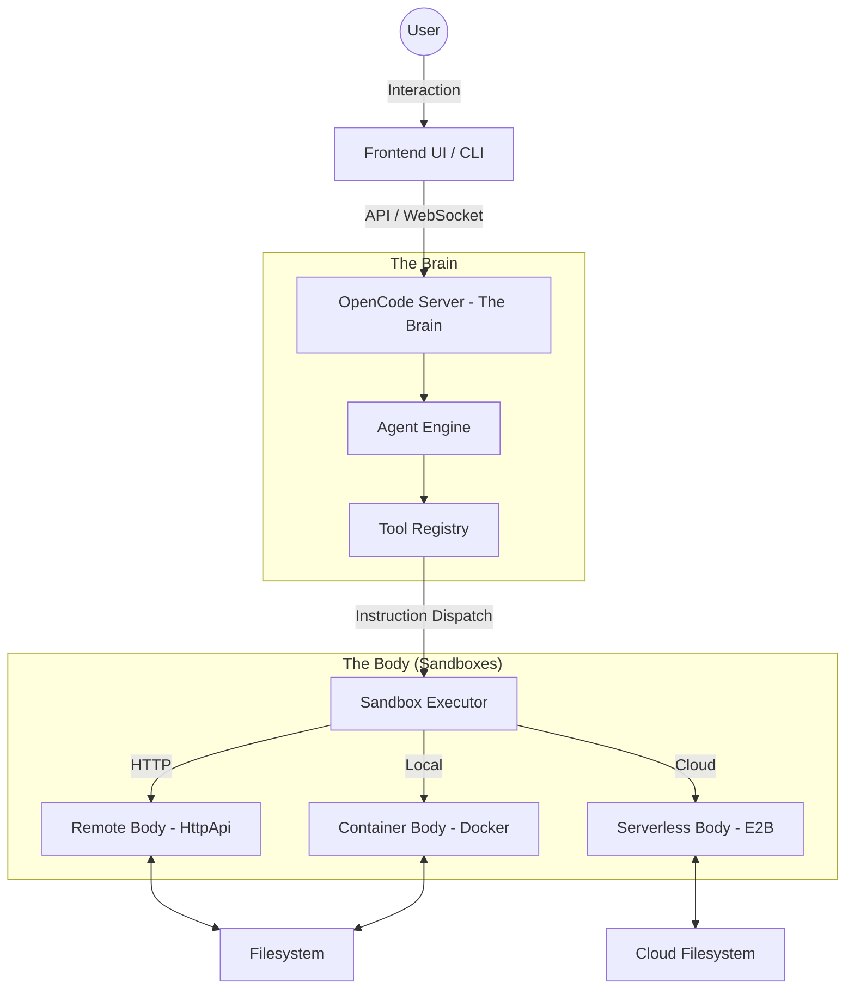

<p align="center">
  <a href="https://opencode.ai">
    <picture>
      <source srcset="packages/console/app/src/asset/logo-ornate-dark.svg" media="(prefers-color-scheme: dark)">
      <source srcset="packages/console/app/src/asset/logo-ornate-light.svg" media="(prefers-color-scheme: light)">
      
    </picture>
  </a>
</p>
<p align="center">Open source AI coding agent - **Reference Edition**</p>

---

## 🏗️ Overall Architecture

This project utilizes an innovative **Brain-Body** architecture, physically decoupling logical reasoning from code execution.

### Architecture Diagram (Mermaid)



### Key Refactor Features:

1.  **Brain-Body Separation**:
    - **Brain**: Runs on the controller side, handling LLM decisions, session state, and security auditing.
    - **Body**: Runs in a controlled isolation environment (sandbox). It only receives authorized atomic instructions (e.g., `read`, `write`, `exec`) from the Brain.

2.  **Multi-Backend Sandbox System**:
    - **HttpApiBackend**: Remote control mode. Manipulates pre-started containers via a lightweight HTTP API.
    - **DockerBackend**: Native container management. Automates creation, volume mounting, and cleanup of session containers using `dockerode`.
    - **E2BBackend**: Serverless cloud sandbox. Provides on-demand allocation of highly secure cloud execution environments.

3.  **Container Lifecycle Management**:
    - Automatic session activity detection with idle timeout destruction (`OPENCODE_CONTAINER_IDLE_TIMEOUT`).
    - Transparent volume mounts ensure code changes persist across container restarts.

4.  **Security Isolation**:
    - All bash commands are hardened at the `Sandbox` layer to prevent the Agent from escaping to the host machine.
    - Sensitive environment variables (API Keys) stay within the "Brain" and are never dispatched to the execution environment.

---

## ✨ Advanced Features

- **Model Context Protocol (MCP)**: Native support for MCP with dynamic tool expansion and OAuth-based authentication.
- **Comprehensive E2E Testing**: Full Playwright test suite covering end-to-end session flows and complex edge cases.
- **Cloud-Native Sandboxing**: Deep integration with E2B for sub-second allocation of isolated cloud development environments.

---

## 🚀 Quick Start

### Environment Setup

Copy `.env.example` and configure your API Keys:

```bash
cp .env.example .env
# Edit the .env file
```

### Local Development

```bash
bun install
bun run dev
```

---

## 🤖 Agents

OpenCode includes two built-in agents you can switch between with the `Tab` key:

- **build**: Default agent with full access for development work.
- **plan**: Read-only agent for analysis and code exploration.

---

## 🛡️ Security & Privacy

- **Variable Masking**: Sensitive API keys have been sanitized in this repository.
- **Execution Auditing**: The "Brain" logs all tool calls for auditability and recovery.

---

## 🤝 Contributing

If you're interested in contributing, please read our [contributing docs](./CONTRIBUTING.md).

---

**Join our community** [Discord](https://discord.gg/opencode) | [X.com](https://x.com/opencode)
