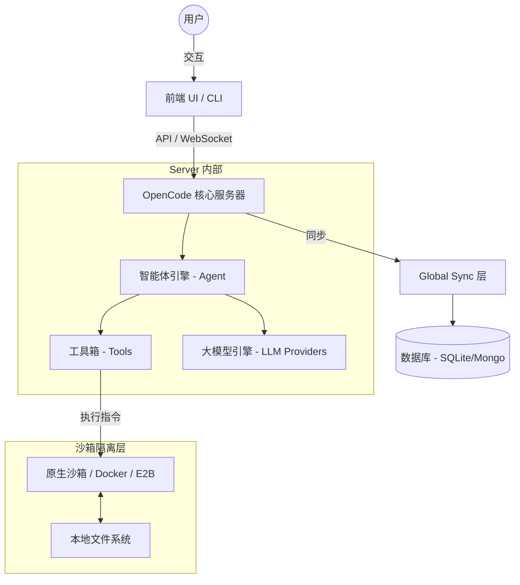

<p align="center">
  <a href="https://opencode.ai">
    <picture>
      <source srcset="packages/console/app/src/asset/logo-ornate-dark.svg" media="(prefers-color-scheme: dark)">
      <source srcset="packages/console/app/src/asset/logo-ornate-light.svg" media="(prefers-color-scheme: light)">
      
    </picture>
  </a>
</p>
<p align="center">开源 AI 编程智能体 (AI Coding Agent)。</p>

---

## 🏗️ 整体架构 (Overall Architecture)

OpenCode 采用高度解耦的 **客户端-服务器 (Client-Server)** 架构，旨在提供跨平台的原生性能与云端灵活性。

### 核心架构图 (Mermaid)



### 关键组件说明：

1.  **Frontend (前端)**: 支持 TUI (终端界面) 和 Web 界面。所有的交互逻辑都通过标准的 API 与后端通信。
2.  **Server (服务端)**: 中央大脑，负责协调智能体决策、工具调用和会话状态管理。
3.  **Agent (智能体)**: 支持多种模式（如 `build` 生产模式和 `plan` 只读规划模式）。
4.  **Sandbox (沙箱)**: **核心安全保障**。OpenCode 在独立沙箱中执行 Bash 命令和读写操作，支持本地 Docker 隔离或云端 E2B 隔离。
5.  **Environment (环境)**: 遵循“原生优先”设计，Agent 能够直接感知并操作其所在的容器或主机环境。

---

## 🚀 快速开始

### 安装

```bash
# Windows
scoop bucket add extras; scoop install extras/opencode
# 或使用 npm
npm i -g opencode-ai@latest
```

### 桌面应用 (BETA)

您可以从 [发布页面](https://github.com/anomalyco/opencode/releases) 下载桌面客户端。

---

## 🤖 智能体说明

OpenCode 内置了两个主要智能体，可以通过 `Tab` 键切换：

- **build**: 默认智能体，具有文件修改和指令执行的全权限。
- **plan**: 只读模式智能体，适用于代码分析和重构规划，在执行危险操作前会强制询问。

---

## 🛡️ 安全与隐私

- **环境变量屏蔽**: 本项目已对敏感 API 密匙进行脱敏处理。
- **沙箱隔离**: 所有的代码执行都在受控沙箱内进行，不会泄露主机权限。

---

## 🤝 参与贡献

如果您想为 OpenCode 做出贡献，请先阅读 [贡献指南](./CONTRIBUTING.md)。

---

**加入我们的社区** [Discord](https://discord.gg/opencode) | [X.com](https://x.com/opencode)
