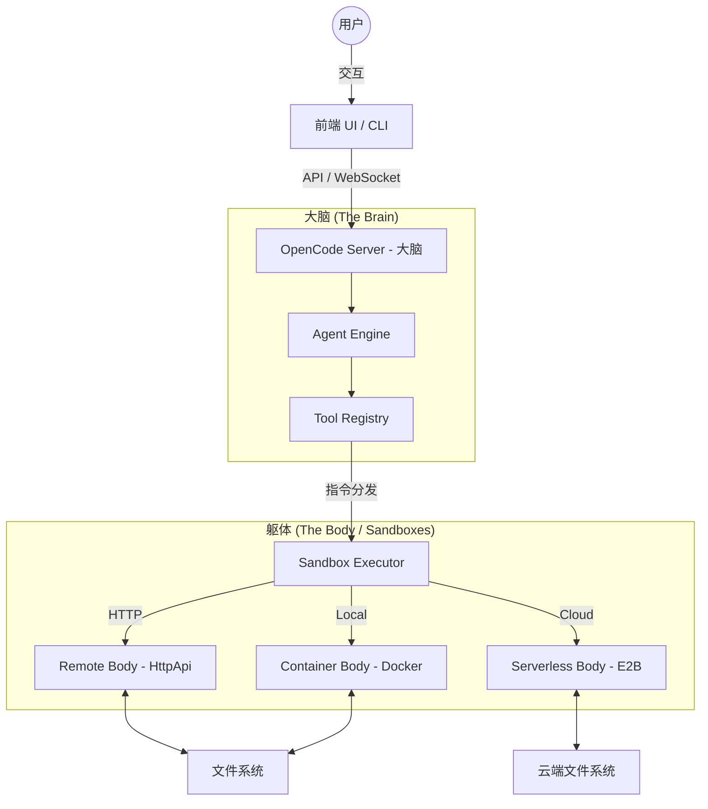

<p align="center">
  <a href="https://opencode.ai">
    <picture>
      <source srcset="packages/console/app/src/asset/logo-ornate-dark.svg" media="(prefers-color-scheme: dark)">
      <source srcset="packages/console/app/src/asset/logo-ornate-light.svg" media="(prefers-color-scheme: light)">
      
    </picture>
  </a>
</p>
<p align="center">开源 AI 编程智能体 (AI Coding Agent) - **Reference 版**</p>

---

## 🏗️ 整体架构 (Overall Architecture)

本项目采用创新的 **大脑-躯体 (Brain-Body)** 架构，实现了逻辑推理与代码执行的物理隔离。

### 核心架构图 (Mermaid)



### 关键重构特性：

1.  **大脑-躯体分离 (Brain-Body Separation)**:
    - **大脑 (Brain)**: 运行在主控端，负责 LLM 决策、会话状态和安全性审计。
    - **躯体 (Body)**: 运行在受控隔离环境（沙箱）。它只接收经过大脑授权的原子指令（如 `read`, `write`, `exec`）。

2.  **多后端沙箱系统 (Multi-Backend Sandbox)**:
    - **HttpApiBackend**: 远程控制模式。通过轻量级 HTTP API 操纵已经启动的容器。
    - **DockerBackend**: 原生容器管理。利用 `dockerode` 自动化创建、挂载卷和销毁会话容器。
    - **E2BBackend**: 云端无服务器沙箱。支持按需分配极其安全的云端执行环境。

3.  **容器生命周期管理 (Container Lifecycle)**:
    - 自动检测会话活跃度，支持空闲超时自动销毁（`OPENCODE_CONTAINER_IDLE_TIMEOUT`）。
    - 透明的卷挂载（Volume Mounts），确保代码变更在容器重启后依然存在。

4.  **安全隔离 (Security Isolation)**:
    - 所有的 bash 指令都在 `Sandbox` 层加固，防止 Agent 逃逸至主控机。
    - 敏感环境变量（如 API Keys）仅保留在“大脑”端，不会下发至执行环境。

---

## ✨ 高级特性 (Advanced Features)

- **Model Context Protocol (MCP)**: 原生支持 MCP 协议，可动态扩展 Agent 的工具集，并支持基于 OAuth 的身份认证。
- **全流程 E2E 测试**: 配备完整的 Playwright 测试套件，覆盖从会话启动到代码生成的全链路场景。
- **云原生沙箱**: 深度集成 E2B，支持在毫秒级分配独立的云端开发环境。

---

## 🚀 快速开始

### 环境变量配置

复制 `.env.example` 并配置您的 API Key：

```bash
cp .env.example .env
# 编辑 .env 文件
```

### 本地开发

```bash
bun install
bun run dev
```

---

## 🤖 智能体说明

OpenCode 内置了两个主要智能体，可以通过 `Tab` 键切换：

- **build**: 默认智能体，具有文件修改和指令执行的全权限。
- **plan**: 只读模式智能体，适用于代码分析和重构规划。

---

## 🛡️ 安全与隐私

- **环境变量屏蔽**: 本项目已对敏感 API 密匙进行脱敏处理。
- **执行审计**: “大脑”端记录所有工具调用日志，方便回溯。

---

## 🤝 参与贡献

如果您想为 OpenCode 做出贡献，请先阅读 [贡献指南](./CONTRIBUTING.md)。

---

**加入我们的社区** [Discord](https://discord.gg/opencode) | [X.com](https://x.com/opencode)
